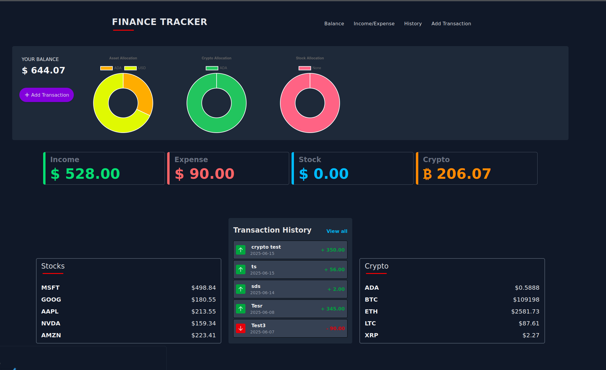
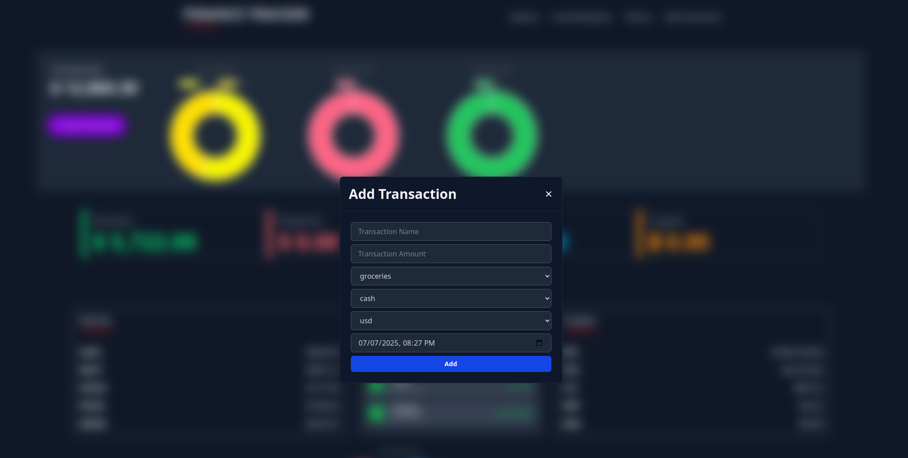
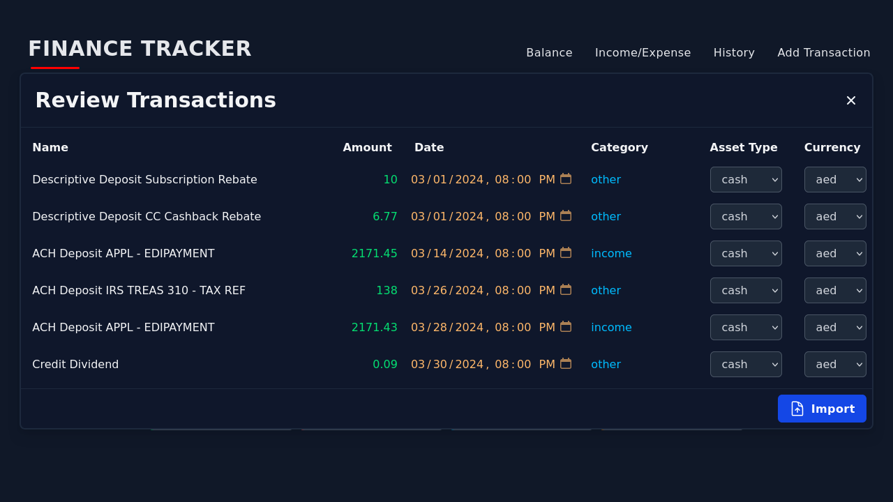
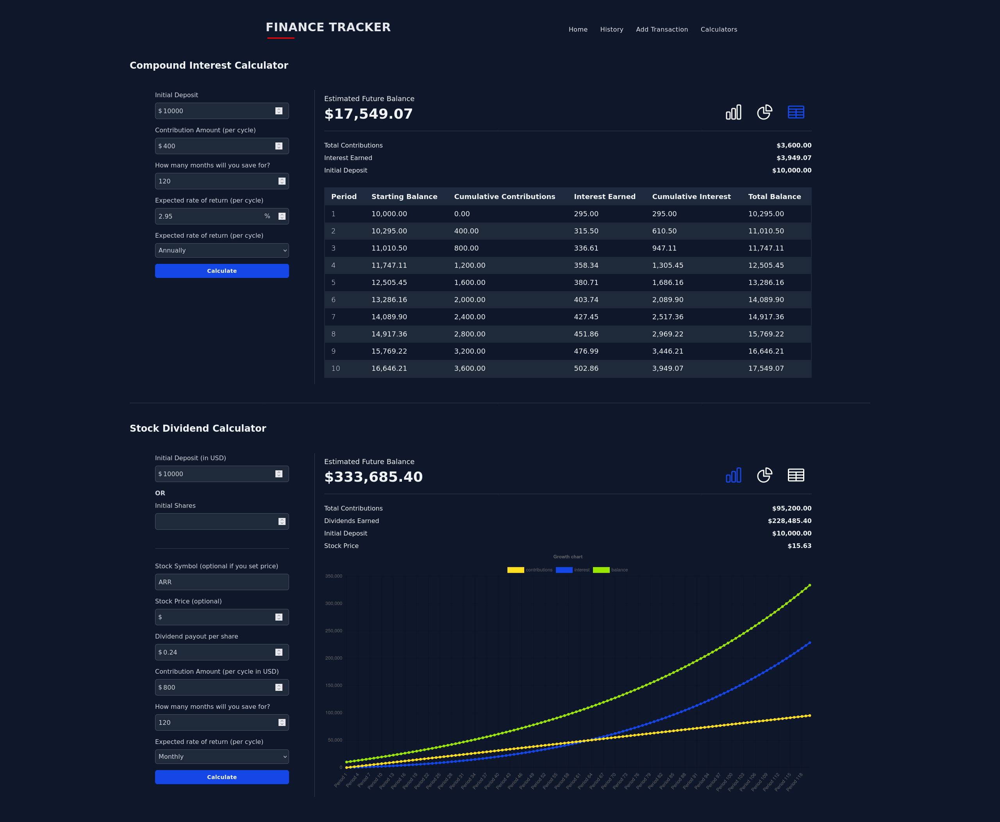

[](https://github.com/JChris246/financial_tracker/actions/workflows/test.yml)
[](https://github.com/JChris246/financial_tracker/actions/workflows/lint.yml)
[](https://github.com/JChris246/financial_tracker/actions/workflows/editor-config-check.yml)

# 💰 Finance Tracker

Finance Tracker started as a simple hobby project by [@c0d3r](https://github.com/c0d3rJ), [@JChris246](https://github.com/JChris246) and [@kac246](https://github.com/kac246).
Today the features include: 

- ➕ Adding transactions for various currency types including:
    - 💲 Fiat currencies like USD
    - 🪙 Crypto currencies like BTC
    - 🤝 Stock shares like AAPL
- 👀 At a glance prices for Stocks and Cryptocurrencies
- ⚖️ Tracking asset balances
- 📊 Charts illustrating asset allocation
- 🧮 Calculators for various estimates

*🚧 This project is still under active development; breaking changes are not unlikely 🚧*

## 📖 Table of contents

- [🚀 Getting-started](#-getting-started)
  - [💻 Running in dev mode](#-running-in-dev-mode)
  - [🐋 Building with Docker](#-building-with-docker)
- [👀 Preview](#-preview)
- [🧪 Testing](#-testing)
- [📓 Future Plans](#-future-plans)
- [⛓️‍💥 Known Limitations](#-known-limitations)

## 🚀 Getting started 

The application stack consists of [React ⚛](https://reactjs.org/) (js) with [Vite ⚡](https://vitejs.dev/) and [tailwindcss](https://tailwindcss.com/) for the UI, while [express js](https://expressjs.com/) with [mongoose](https://mongoosejs.com/) (and later options for sqlite and possibly redis) on the server side.

### 💻 Running in dev mode

1. Make a .env file in the server folder, with your values for the variables in the [.env.sample](server/.env.sample). DB_TYPE variable should have 1 of the accepted types: 
    - `mongo` - to connect to a mongo database (be sure provide the connection vars)
    - `json` - to use flat json files for storage
    - `sql` - to use sqlite as the database

2. Navigate to the server directory in a terminal and run the server with: `npm start`
3. Navigate to the client directory (preferably in a new terminal) and start the client dev server with `npm run dev`
4. In a browser launch [localhost:5173](http://localhost:5173) to view the app.

### 🐋 Building with Docker

To build the docker image yourself you can use `docker build -t financial_tracker:1.0.0 .` while in the root of the project. This will read and perform the actions described in the Dockerfile. 

You can also (and the recommended way) use the docker compose files included at the root of the repo. docker-compose.yml is setup to use sqlite as the database and the `DB_TYPE` value can be swapped for `json` if you prefer.
Simply run `docker-compose up --build -d` to launch (the build flag can be omitted if the image is already built).

docker-compose-mongo.yml *should* be setup to use the app with a mongo database. Run `docker-compose -f docker-compose-mongo.yml up --build -d` to get up and running.

*Ensure you have all the appropriate env vars set in all instances.*

The app should then be accessible on port 3040 (you can change this in either compose file) [localhost:3040](http://localhost:3040).

## 👀 Preview









## 🧪 Testing

Currently, automated testing is bit of a mess 🫣, but the existing setup should be able to cover some of the main scenarios:

### 📏 Client unit tests

```bash
cd client
npm run test:unit
```

### 📏 Server unit tests

```bash
# Some of these tests require internet access
cd server
npm run test:unit
```

### 🎯 Server api tests

```bash
cd server
npm run test:integration
```

### ↔️ Integration / End to End tests

```bash
cd integration
npm run test:e2e
```

## 📓 Future Plans

- [ ] ~~import transactions from csv~~ use AI to determine how to parse csv and md columns (when not mapped 1 to 1)?
- [ ] add edit/delete button for each transaction in the transaction history table
- [ ] display balance for individual assets (stocks, crypto and cash)
- [ ] create mcp server endpoints
- [x] dockerize the app
- [x] implement sqlite db option
- [x] add UI to allow downloading transactions as csv or md table
- [ ] allow exporting calculator results to pdf
- [ ] add more calculators for mortgages and car loans

## ⛓️‍💥 Known Limitations

*🚧 This project is still under active development; breaking changes are not unlikely 🚧*
